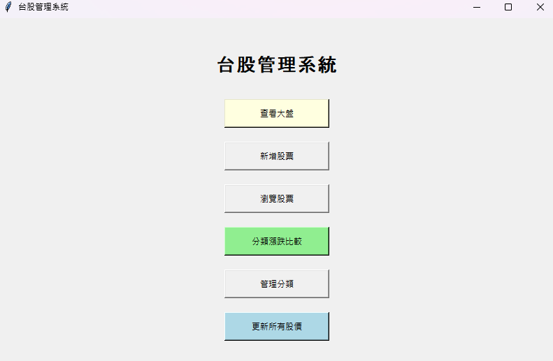
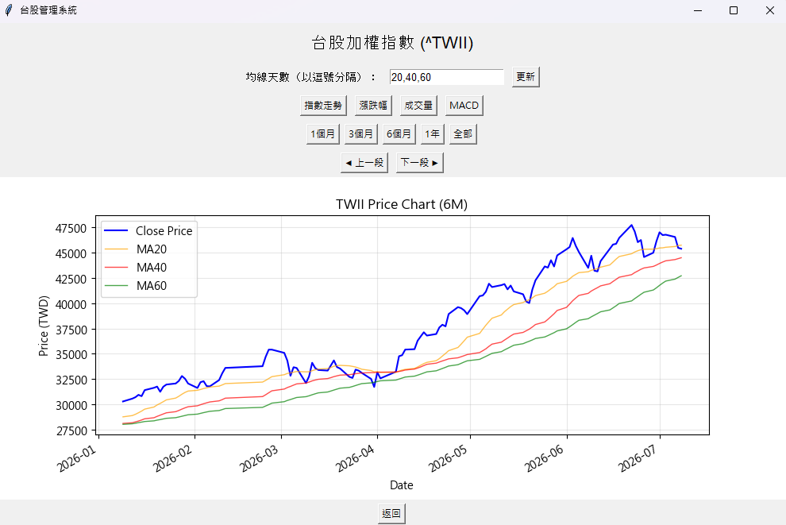
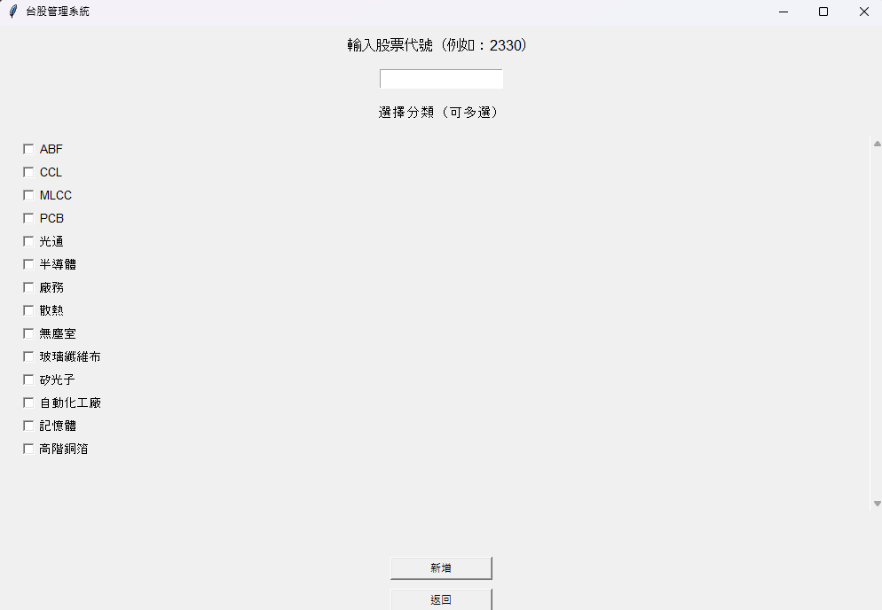
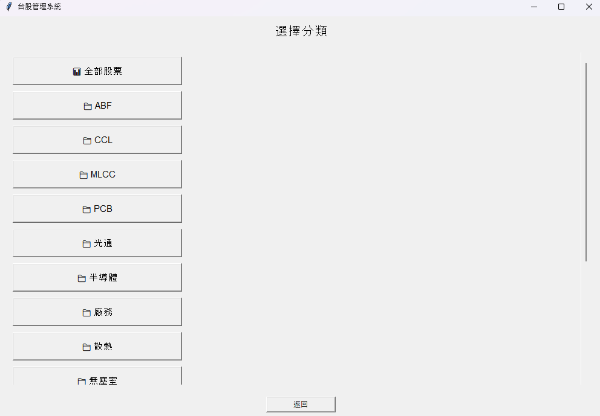
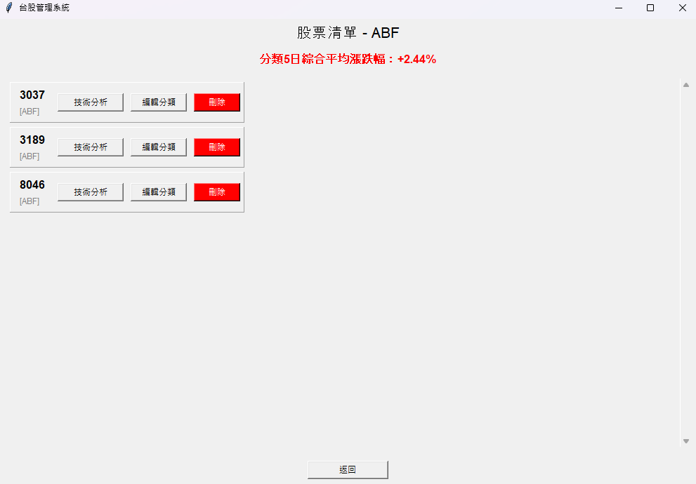
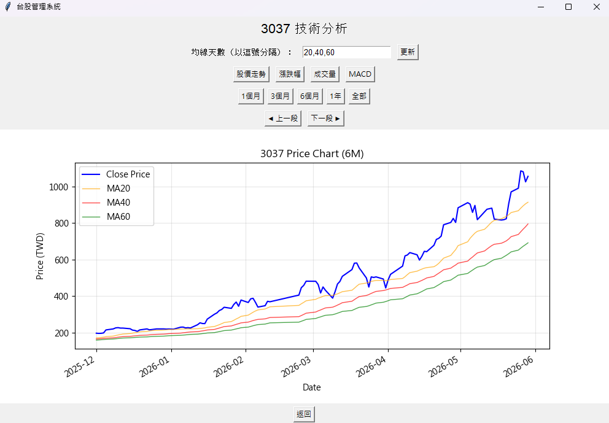
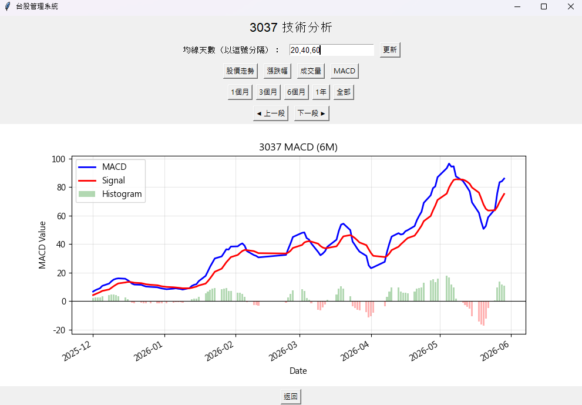
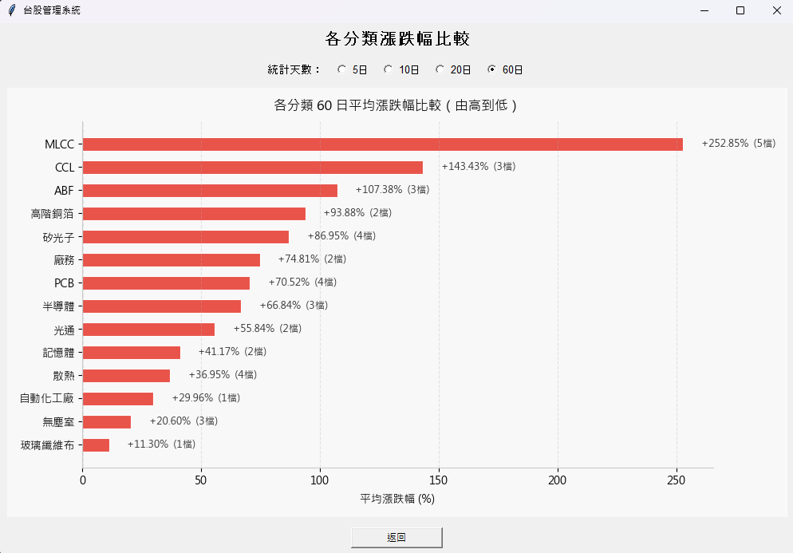
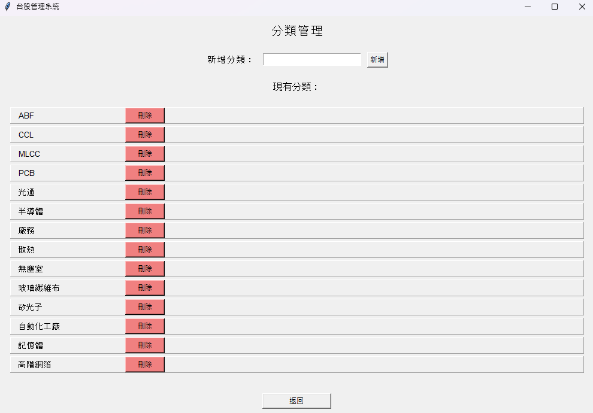

# 台股管理系統 Taiwan Stock Management System

一個以 Python + Tkinter 打造的桌面應用程式，用於追蹤、管理台股股票資料，並提供技術分析圖表、分類管理與大盤走勢查詢功能。

---

## 介面顯示
### 主畫面

### 大盤走勢查詢

### 新增股票


### 股票清單瀏覽



### 個股技術分析（股價 / 漲跌幅 / 成交量 / MACD）



### 分類漲跌比較


### 分類管理


---

## 功能特色

- **查看大盤**：即時抓取台股加權指數（^TWII）並繪製走勢圖
- **新增股票**：輸入股票代號自動判斷上市（.TW）或上櫃（.TWO），並可同時指定分類
- **瀏覽股票**：依分類篩選股票清單，顯示分類 5 日綜合平均漲跌幅
- **個股技術分析**：
  - 股價走勢圖（可自訂多條均線 MA）
  - 每日漲跌幅長條圖
  - 成交量長條圖（含均量線）
  - MACD 指標圖
  - 支援 1 個月 / 3 個月 / 6 個月 / 1 年 / 全部區間切換，並可上一段 / 下一段瀏覽歷史區間
- **分類漲跌比較**：以水平長條圖比較各分類的平均漲跌幅（可選 5 / 10 / 20 / 60 日）
- **分類管理**：新增、刪除分類，股票可對應多個分類
- **刪除股票**：可移除股票所有價格資料與分類關聯
- **更新所有股價**：一鍵更新資料庫中所有股票至最新資料

---

## 技術棧

| 類別       | 使用工具                          |
|------------|-----------------------------------|
| GUI        | `tkinter`                         |
| 資料抓取   | `yfinance`                        |
| 資料處理   | `pandas`                          |
| 圖表繪製   | `matplotlib`（嵌入 Tkinter）      |
| 資料庫     | `sqlite3`                         |

---

## 專案結構

```
.
├── main.py              # 主程式（GUI 介面與圖表繪製邏輯，對應 TaiwanStockApp）
├── database.py           # 資料庫存取層（建表、查詢、分類管理等）
├── download_data.py       # 股價資料抓取與更新（yfinance）
└── database/
    └── taiwan_stock.db    # SQLite 資料庫（程式首次執行時自動建立）
```


### 資料庫結構

- **price_daily**：股票每日價格資料（開高低收、成交量、股利、股票分割）
- **categories**：分類清單
- **ticker_categories**：股票與分類的多對多對應關係

---

## 安裝方式

1. 確認已安裝 Python 3.9 以上版本
2. 安裝相依套件：

```bash
pip install yfinance pandas matplotlib
```

> `tkinter` 與 `sqlite3` 皆為 Python 標準函式庫，通常無需另外安裝（部分 Linux 發行版需另外安裝 `python3-tk`）。

---

## 使用方式

在專案根目錄執行：

```bash
python main.py
```

程式啟動後會自動建立 SQLite 資料庫與相關資料表，接著即可透過主畫面操作：

1. 點選「新增股票」輸入股票代號（例如 `2330`），系統會自動嘗試 `.TW` / `.TWO` 後綴
2. 點選「瀏覽股票」查看已加入的股票，並可進入「技術分析」查看走勢圖
3. 點選「分類漲跌比較」比較不同分類的漲跌表現
4. 點選「更新所有股價」同步最新股價資料

---

## 注意事項

- 股價資料來源為 Yahoo Finance（`yfinance`），需要網路連線才能抓取或更新資料
- 中文字型設定為 `Microsoft JhengHei` / `Microsoft YaHei`，若在非 Windows 系統執行，圖表中文可能需自行調整字型設定
- 資料庫檔案會儲存在 `database/taiwan_stock.db`，刪除該檔案即可重置所有資料

---

